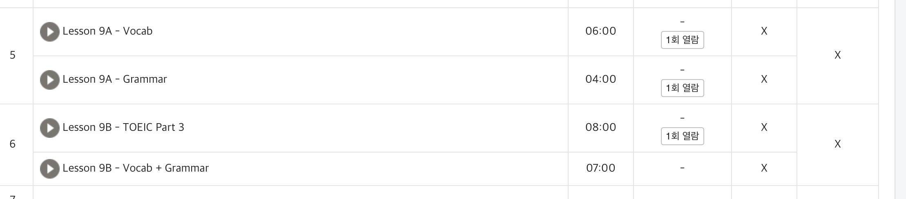

# Do Not Forget Homework (온라인 강의 결석 방지 자동화)


## 왜 만들었나?

반복되는 결석과 실수로 인해 자동으로 강의/과제 알림을 받고, 리마인더에 등록해두면 이런 상황을 예방할 수 있을 것 같아 만들게 됐어요


## 이게 뭐하는 건가요?

- LMS(온라인 강의 시스템)에서 시청해야 할 동영상, 제출해야 할 과제 목록을 자동으로 크롤링합니다.
- 이미 완료된 항목은 제외하고, 중복 없이 정리합니다.
- node-reminders API를 통해 macOS 리마인더에 자동으로 등록합니다.
- 마감일(dueDate)과 하루 전(remindMeDate)에 알림을 설정해 놓칩니다 방지합니다.
- macOS launchd를 이용해 매일 아침 자동으로 실행되도록 설정할 수 있습니다.

## 어떻게 쓰나요?

1. `installer.js`를 실행해서 id, pw를 입력하면 `credentials.json`과 launchd용 plist가 생성됩니다.
2. `index.js`(혹은 main 스크립트)를 실행하면 LMS에서 할 일 목록을 자동으로 리마인더에 추가합니다.
3. launchd를 이용해 자동으로 매일 아침 9시에 돌아갑니다

> 아 참고로 코드 보면 어차피 아시겠지만 id, pw는 기기에만 저장됩니다 😆

여러분의 온라인 수업이 평온하시길.. 

```bash
npm install
npm run install
```